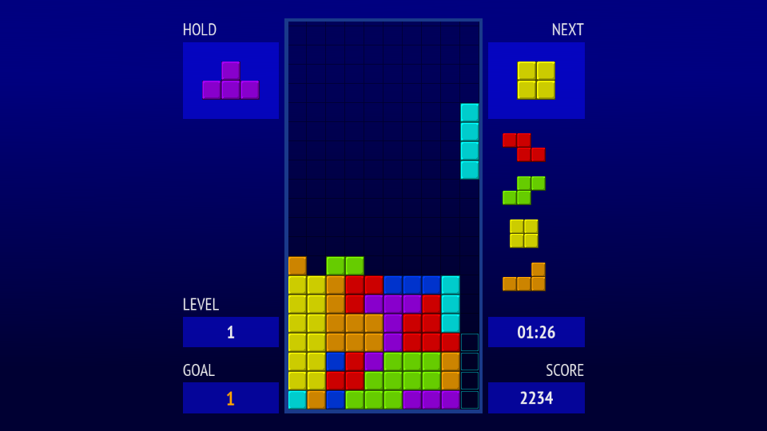

OpenBlok
========

[](https://travis-ci.org/mmatyas/openblok)
[](https://ci.appveyor.com/project/mmatyas/openblok)

A customizable, cross platform, open-source falling block game, packed with a bunch of features.



**Features:**

- [x] Ghost piece support
- [x] Hold piece support
- [x] Customizable next pieces support
- [x] Customizable DAS support
- [x] SRS, TGM and Classic rotation
- [x] Full wall- and floor kick support
- [x] 7-piece bag random generator
- [x] Classic, Extended and Infinity lock support
- [x] Sonic drop and Zangi-move support
- [x] T-Spin and Mini T-Spin support
- [ ] Combo support
- [ ] ARE support
- [x] Gamepad support
- [ ] Menu, configuration and stats
- [ ] Battle mode
- [x] Music and sound effects
- [x] Big screen support
- [x] Small screen support
- [x] Runs on most desktop systems
- [x] Runs on embedded Linux, even without X11
- [x] Runs in browsers (experimental)
- [ ] Mobile (touch) support
- [ ] Mouse support


Dependencies
------------

- CMake 3.1+
- C++14 supporting compiler (GCC 4.9 or better)
- SDL2, SDL2_image, SDL2_mixer, SDL2_ttf
- gcov, lcov (only for generating test coverage report)

Eg. on Debian: `sudo apt install cmake libsdl2-dev libsdl2-image-dev libsdl2-mixer-dev libsdl2-ttf-dev`


Build
-----

```sh
mkdir build && cd build
cmake ..
make
cd .. && ./build/src/openblok
```

**Optional build parameters:**

- `BUILD_TESTS`: Builds the test suite. You can run them by calling `./build/tests/openblok_test`. Debug build only, default: `ON`.
- `BUILD_COVERAGE`: Allows building the test coverage report. Requires `BUILD_TESTS` and `gcov`/`lcov`. Default: `OFF`.
- `DATADIR`: Location of the data directory. Defaults to `./data` in debug build, and `<INSTALL LOCATION>/share/openblok` in release.

**Additional build targets**

- `make coverage`: Builds the test coverage report
- `make install/strip`: Installs the game on your system
- `make package`: Creates `tar.gz` and Debian `deb` packages


Notes
-----

**Hardware acceleration on ARM Linux**

Using the default SDL2 library shipped with Debian/Raspian, hardware acceleration may not work properly, causing slowness and ugly graphics. For the best performance, it is recommended to build your own SDL2, as described [here](https://github.com/mmatyas/openblok/wiki/Custom-SDL2-build-for-ARM). With hardware acceleration, OpenBlok runs full speed even on a first-gen Raspberry Pi.
